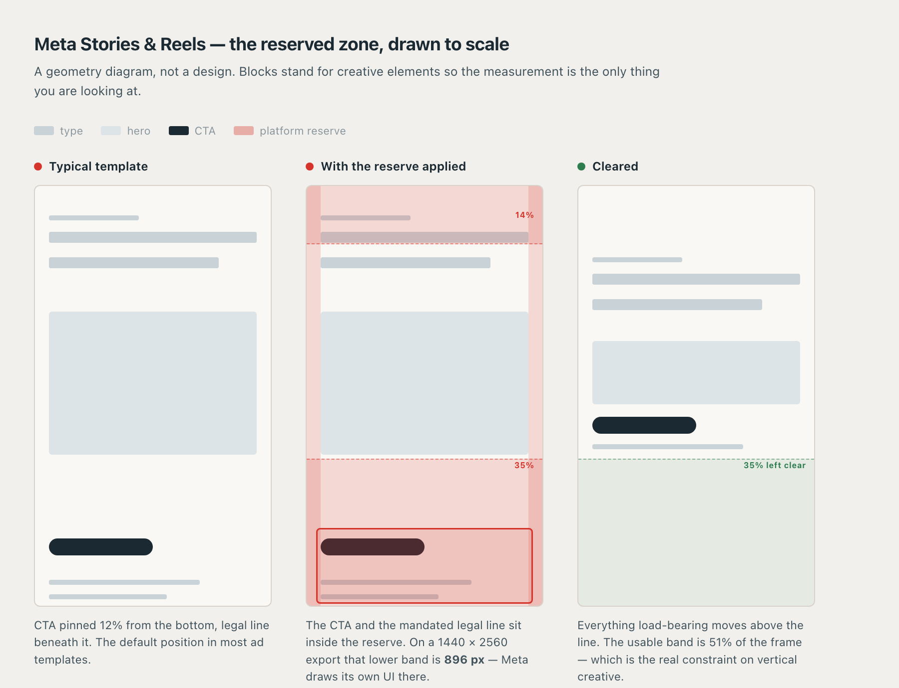

# GF Creative Team

**An agent team that designs your ad creative in Figma — and reviews it before you see it.**

Seven roles: copywriter, creative director, art director, production designer, design analyst, quality
officer, financial controller. You give them a brief; they give you built, checked artwork.

```bash
claude plugin marketplace add hadicancatak-coder/GF-Creative-Team
claude plugin install gf-creative-team@gf-creative-team
```

```
/create-ad  Spring campaign for the Drift commuter e-bike, UK + DE, Meta Feed and Stories
```

---

## What the team actually says

Not a pitch — verbatim output from a live run. Nothing here was prompted for.

> **Art director**, refusing to select a hero:
> *"`drift-three-quarter.png` is not a different angle. Across the frame region the two files share
> **31,152 matching ink pixels against 29 mismatching** — 0.09% deviation. It is the same profile
> drawing with a handlebar added and the ground line removed."*

> **Art director**, on a layer named "keyed, source-only":
> *"An assertion is not a citation."* — BLOCK under source law.

> **Design analyst**, disproving the designer's own self-report on optical centring:
> *"The true value is 0.01 or 3.38 depending on whether the descender of 'y' counts as optical mass.
> **2px is neither.**"*

> **Creative director**, striking its own directive:
> *"The gap loses at squint because it is **open to the background**. An unenclosed absence is not a
> figure and cannot become one at any crop or any scale. I specified a subject that is structurally
> incapable of being a subject. That is my error, not the designer's and not the AD's."*

> **Design analyst**, blocking the master size against a sourced spec:
> *"1080×1080 conforms to neither named Meta placement — **25.0% off Feed's 4:5 against a 3%
> tolerance**, and no 9:16 asset exists."*

That is what separates seven roles from one prompt that says "you are a senior designer": they check
each other, and they are allowed to refuse.

## Why it behaves that way

**Every rule in it exists because breaking it cost something first.** The eval table records its own
history — 42 cases, each naming the agent that must catch it unhinted, each marked with the outcome.

**Twelve are marked MISSED.** A human found those, the gates did not. `MISSED — client deleted the
work` is a row in this repo. So is `MISSED — client caught after ~500k tokens`. Eleven more were found
by running the thing during its own development, including a command that would have spent 600k tokens
on the word `undefined`.

Most repos publish their wins. The misses are the reason the rules above them are worded the way they are.

## What it knows

Platform specs for **Meta, Google, TikTok and LinkedIn** — every figure traced to the platform's own
documentation, dated, with a `review_by` that **fails CI when it expires**. Unverifiable figures are
marked `TBD — unverified`, never guessed.

So it catches the CTA sitting under the Instagram Stories UI, the 4:5 variant you didn't build, the
export that passes Meta's 30 MB and fails Google's 5 MB, the PMax asset group with two headlines that
will not serve, and the TikTok carousel image over 100 KB.



*A geometry diagram, not a design — blocks stand for creative elements so the measurement is the only
thing you judge. Sourced and dated in [`knowledge/platforms/meta.md`](knowledge/platforms/meta.md).*

## Commands

| | |
|---|---|
| **`/create-ad`** | Brief to built artwork. Copy → concept → asset selection → build in Figma → verify. |
| `/creative-gate` | Review built creative. Plan → gate → fix → re-gate → verdict. |
| `/format-matrix` | What to build for these platforms. **Works with no setup at all.** |
| `/new-client` · `/use-client` | Scaffold and switch client profiles. |

## The roles

| Agent | The job | What you get back |
|---|---|---|
| **creative-director** | Concept, meaning, who reviews what | Verdict, ≤5 notes, the set's biggest weakness |
| **art-director** | Picks the asset, verifies the render | A selection — **or a refusal and a client ask** |
| **designer** | Builds. The only one that writes to Figma | Changed node IDs, measured deviations |
| **design-analyst** | Measures against tokens and platform specs | Property, measured, expected, node ID, fix |
| **quality-officer** | Last gate: regulation, claims, regional rules | SHIP / COMP-APPROVED / BLOCK |
| **content-creator** | Copy before design, audits after | Deck + a CLIENT-VERIFY list |
| **financial-controller** | Reads the run ledger | Cost per confirmed finding, waste sources |

**Hire them separately.** A copy deck is one agent. A second pair of eyes on a finished set is two.

## Requirements

Claude Code with the Agent and Workflow tools. **The Figma MCP** for anything that builds artwork —
every review role works on rendered screenshots from any source, the `designer` role does not.

## What is proven, and what is not

**Proven:** installs from this URL and runs. Seven agents produce the findings quoted above,
unprompted. 42 eval cases, CI green, validator clean.

**Not proven:** no creative has yet gone through end to end to a shipped `SHIP`. Three comps exist; the
run is written up in [examples/first-live-run.md](examples/first-live-run.md) — including what it cost
and the bug it found in this plugin.

## Read next

**[The team](docs/THE-TEAM.md)** — a job description per role · **[Quickstart](docs/QUICKSTART.md)** ·
**[The method](docs/METHOD.md)** — what transfers to any domain ·
**[A worked gate run](examples/worked-gate-run.md)**

## Contributing

The most valuable contribution is **a failure this team did not catch.** See
[CONTRIBUTING.md](CONTRIBUTING.md). `./scripts/validate.sh` is the whole gate; CI runs the same script.

MIT — see [LICENSE](LICENSE).
